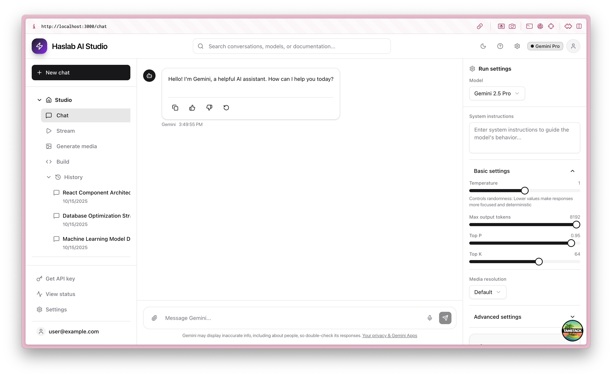
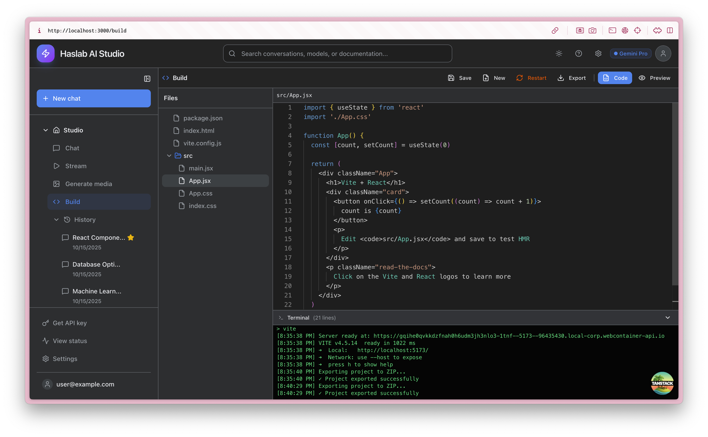
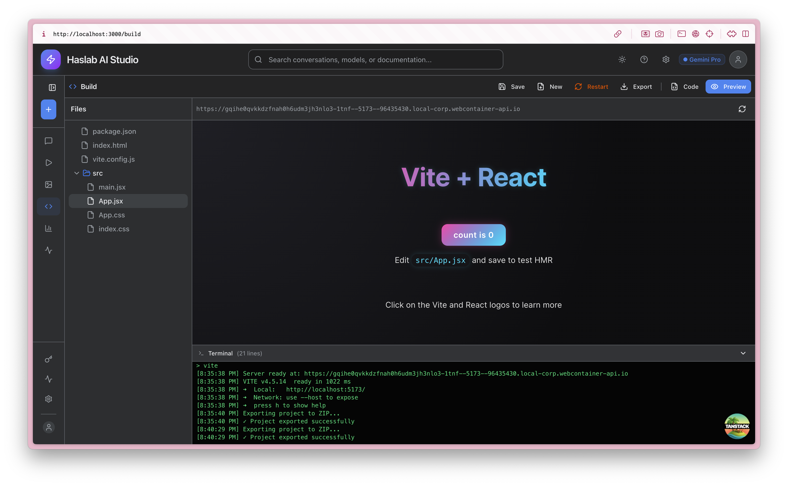
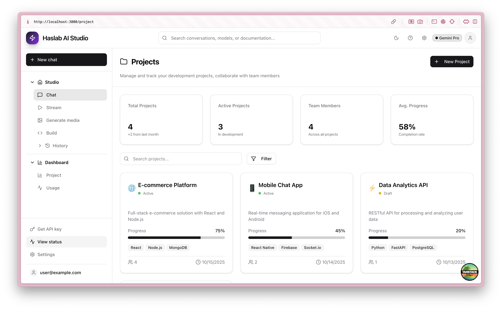
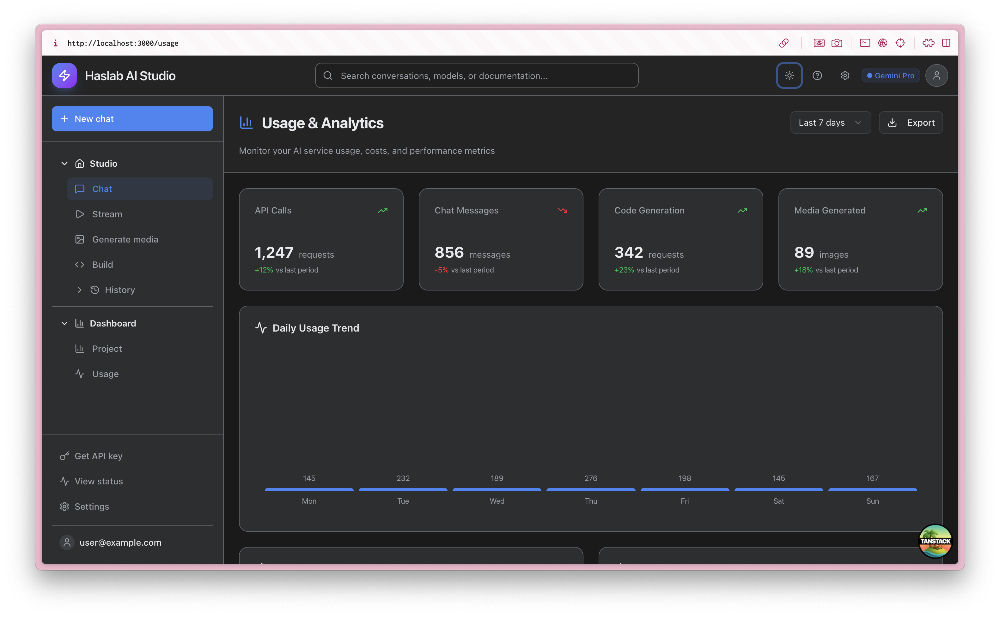
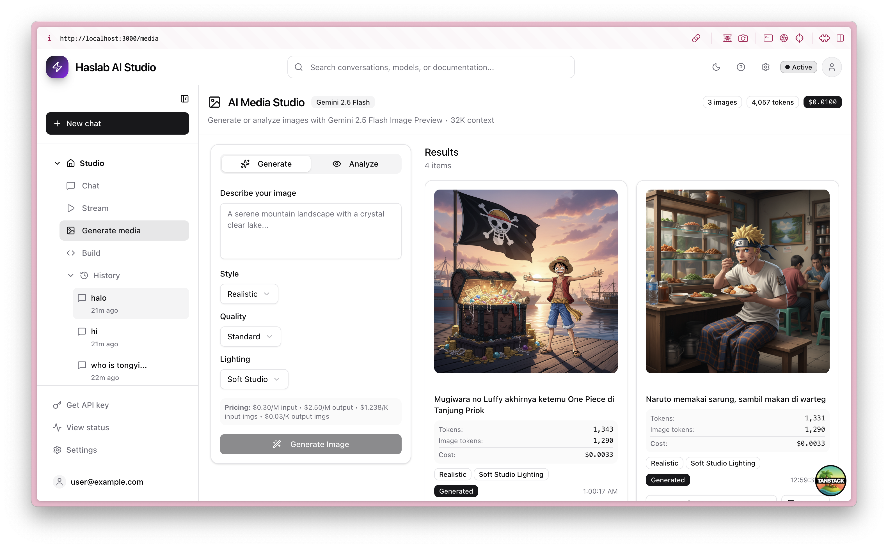

# 🚀 Haslab AI Studio

A modern, full-featured AI development workspace built with React, TypeScript, and Tailwind CSS. Haslab AI Studio provides a comprehensive suite of AI-powered tools for chat interactions, code generation, media creation, project management, and usage analytics.



## ✨ Features

### 🏠 **Studio Workspace**
- **💬 Chat Interface** - Interactive conversations with AI models with persistent storage
- **🌊 Stream Mode** - Real-time streaming responses with LangChain integration
- **🎨 Generate Media** - Gemini 2.5 Flash image generation and vision analysis
- **🔨 Code Editor** - Full-featured IDE with WebContainer, live preview, and hot reload
- **📂 Conversation History** - Persistent chat history with localStorage

### 🆕 **Latest Updates - Code Editor**

#### **Full-Featured IDE in Browser**
- **📁 Virtual File System** - Tree view for browsing and managing project files
- **✏️ Monaco Code Editor** - VS Code's editor with syntax highlighting
- **👁️ Live Preview** - Instant preview with Vite dev server via WebContainer
- **🔥 Hot Module Reload** - See changes instantly without page refresh
- **💾 Smart Auto-Save** - Debounced auto-save (1s) that only saves real changes
- **⌨️ Keyboard Shortcuts** - `Ctrl+S`/`Cmd+S` for manual save
- **📦 Export to ZIP** - Download entire project with folder structure preserved

#### **WebContainer Integration**
- **🐳 Browser-Based Node.js** - Full Node.js environment running in browser
- **📦 npm Install** - Install dependencies directly in browser
- **⚡ Vite Dev Server** - Fast HMR with instant feedback
- **🔒 Isolated Environment** - Sandboxed execution for security
- **🖥️ Terminal Output** - Real-time logs from npm and Vite

#### **Developer Experience**
- **🎯 Double-Click Navigation** - Double-click file to open in code view
- **📝 Create New Files** - Quick file creation with template
- **🔄 Server Restart** - Manual restart option for clean state
- **📊 Terminal Panel** - Collapsible terminal with build logs and errors
- **🎨 Syntax Highlighting** - Support for JS, JSX, TS, TSX, CSS, HTML, JSON
- **💡 Smart Features** - No auto-save on file open, only on actual changes

#### **UI Enhancements**
- **📐 Collapsible Sidebar** - Minimize to icons-only mode for more space
- **🎯 Active Route Detection** - Sidebar highlights current page
- **💬 Chat Title Tooltips** - Hover to see full conversation titles
- **📏 Consistent Layout** - Optimized spacing in collapsed/expanded modes

### 📊 **Dashboard & Analytics**
- **📁 Project Management** - Track development projects and collaborations
- **📈 Usage Analytics** - Monitor API usage, costs, and performance metrics
- **💰 Cost Tracking** - Detailed breakdown of AI service costs
- **🔍 Search & Filtering** - Find projects and conversations quickly

### 🎛️ **Advanced Configuration**
- **⚙️ Model Settings** - Temperature, token limits, and advanced parameters
- **🔧 Tool Integration** - Code execution, function calling, and grounding
- **🎯 Multi-Model Support** - Gemini Pro, GPT-4, Claude, and more
- **📱 Responsive Design** - Works seamlessly on desktop and mobile

## 🖼️ Screenshots

### Code Editor
Full-featured code editor with WebContainer integration, live preview, and hot module reloading.



### Live Preview
Real-time preview with WebContainer running Vite dev server directly in the browser.



### Chat Interface
The main chat interface with AI conversation capabilities, message history, and real-time responses.


### Project Management
Comprehensive project dashboard with progress tracking, team collaboration, and project analytics.



### Usage Analytics
Detailed usage monitoring with cost breakdown, service metrics, and performance tracking.



### Image Generation
AI-powered image generation with Gemini 2.5 Flash, including style helpers, quality presets, and real-time cost tracking.



## 🛠️ Tech Stack

- **Frontend Framework**: React 19.0 with TypeScript
- **Routing**: TanStack React Router
- **Styling**: Tailwind CSS 4.0 with @tailwindcss/typography plugin
- **UI Components**: Radix UI primitives with custom styling
- **State Management**: TanStack React Query + Store
- **AI Integration**: LangChain (@langchain/deepseek, @langchain/openai, @langchain/core)
- **Markdown Rendering**: react-markdown with remark-gfm and rehype-highlight
- **Code Editor**: Monaco Editor (VS Code editor)
- **WebContainer**: @webcontainer/api for in-browser Node.js
- **File Compression**: JSZip for project export
- **Icons**: Lucide React
- **Build Tool**: Vite 7.0
- **Development**: TypeScript 5.7 with strict configuration

## 🚀 Getting Started

### Prerequisites

- Node.js 18+ 
- npm or yarn package manager

### Installation

1. **Clone the repository**
```bash
git clone https://github.com/yourusername/haslab-ai-studio.git
cd haslab-ai-studio
```

2. **Install dependencies**
```bash
npm install
```

3. **Start development server**
```bash
npm run dev
```

4. **Open in browser**
Navigate to [http://localhost:3000](http://localhost:3000)

### Build for Production

```bash
npm run build
npm run serve
```

## 🎨 Design System

### Color Palette
- **Primary**: Google Blue (#4285f4) - Primary actions and accents
- **Background**: Deep charcoal (#1a1a1a) - Main application background  
- **Cards**: Elevated surfaces (#2d2e30) - Panel and card backgrounds
- **Text**: High contrast whites (#e8eaed) - Primary text content
- **Muted**: Secondary grays (#9aa0a6) - Supporting text and UI elements

### Typography
- **Font Family**: Google Sans, Roboto, system fonts
- **Scale**: Carefully crafted type scale for optimal readability
- **Weights**: 400 (normal), 500 (medium), 600 (semibold), 700 (bold)

## 📁 Project Structure

```
src/
├── components/          # Reusable UI components
│   ├── ui/             # Base UI primitives
│   ├── chat/           # Chat-specific components
│   └── layout/         # Layout components (Header, Sidebar)
├── routes/             # Page components and routing
│   ├── __root.tsx      # Root layout
│   ├── index.tsx       # Dashboard home
│   ├── chat.tsx        # Chat interface
│   ├── stream.tsx      # Stream interface
│   ├── media.tsx       # Media generation
│   ├── build.tsx       # Code generation
│   ├── project.tsx     # Project management
│   └── usage.tsx       # Usage analytics
├── lib/                # Utilities and helpers
├── styles.css          # Global styles and theme
└── main.tsx            # Application entry point
```

## 🔧 Key Components

### Chat Interface
- **Real-time messaging** with AI models (DeepSeek, OpenRouter, iFlow)
- **LangChain integration** - Using @langchain/deepseek and @langchain/openai
- **Message history** with persistent localStorage
- **Conversation management** - Create, load, delete conversations from sidebar
- **Markdown rendering** - Rich text display with syntax highlighting (react-markdown + rehype-highlight)
- **New chat** functionality with conversation switching
- **Response actions** (copy to clipboard)
- **Streaming support** - Real-time token-by-token responses

### Code Editor (Build)
- **WebContainer Integration** - Full Node.js environment in browser
- **Monaco Editor** - Professional code editor with IntelliSense
- **Live Preview** - Real-time preview with Vite HMR
- **File System** - Complete virtual file system with tree navigation
- **Smart Auto-Save** - Intelligent auto-save with 1-second debounce
- **Terminal Output** - Real-time logs from build processes
- **Export Project** - Download as ZIP with folder structure
- **Multi-Language Support** - JavaScript, TypeScript, JSX, TSX, CSS, HTML, JSON
- **Hot Reload** - Instant updates on save without full page refresh
- **Create Files** - Quick file creation from UI
- **Keyboard Shortcuts** - `Ctrl+S`/`Cmd+S` for manual save

### Media Generation (Gemini 2.5 Flash)
- **Text-to-image** generation using Google Gemini 2.5 Flash Image Preview
- **Image Analysis** - Upload images and get AI-powered analysis with vision model
- **Style controls** - 11 styles: Realistic, Anime, Cartoon, 3D Render, Oil Painting, Watercolor, Sketch, Pixel Art, Cyberpunk, Fantasy
- **Quality presets** - Standard, High Detail, Ultra HD, Cinematic
- **Lighting options** - Golden Hour, Soft Studio, Dramatic, Neon, Natural
- **Enhanced prompt preview** - See how your prompt is enhanced with modifiers
- **Usage metrics** - Real-time token usage and cost tracking
- **Pricing transparency** - $0.30/M input tokens, $2.50/M output tokens, $1.238/K input images, $0.03/K output images
- **Image gallery** with download and copy capabilities
- **Base64 image support** - Direct display of generated images

### Project Management
- **Project cards** with progress tracking
- **Team collaboration** features
- **Technology stack** labeling
- **Status management** (Active, Draft, Archived)
- **Search and filtering** capabilities

### Usage Analytics
- **Service usage** monitoring and visualization
- **Cost tracking** with detailed breakdowns
- **Performance metrics** and trends
- **Export capabilities** for reporting
- **Real-time updates** and notifications

## 🎯 Features in Detail

### Accordion Navigation
The sidebar uses a hierarchical accordion structure:

- **🏠 Studio** (Main workspace)
  - Chat - Interactive AI conversations
  - Stream - Real-time streaming mode  
  - Generate media - AI image generation
  - Build - Code generation assistant
  - **📂 History** - Conversation and project history
    - Recent conversations with star favorites
    - Project timeline and activity

- **📊 Dashboard** (Analytics & Management)  
  - Project - Development project management
  - Usage - Analytics and cost monitoring

### Right Panel Configuration
- **Model selection** with provider information
- **Parameter controls** (Temperature, Max tokens, Top P, Top K)
- **Media settings** (Resolution, format options)
- **Advanced features** (Thinking mode, Structured output)
- **Tool integrations** (Code execution, Function calling, Grounding)

## 📋 Changelog

### v2.1.0 - AI Image Generation & LangChain Migration (Latest)

#### 🎉 Major Features
- **Gemini Image Generation** - Text-to-image using Google Gemini 2.5 Flash Image Preview
- **Vision Analysis** - Upload and analyze images with Gemini vision model
- **Style Helpers** - 11 art styles including Realistic, Anime, Cartoon, Pixel Art, etc.
- **Quality & Lighting Presets** - Professional controls for image enhancement
- **Usage Metrics** - Real-time cost tracking with token and image usage
- **LangChain Migration** - Migrated from AI SDK to LangChain for better control
- **Markdown Chat** - Full markdown rendering with syntax highlighting
- **Persistent Storage** - Conversation history saved in localStorage

#### ✨ Improvements
- **Enhanced Prompt Preview** - See how modifiers enhance your prompt
- **Cost Transparency** - Header shows total tokens, images, and cost
- **Per-Image Metrics** - Each generation shows individual token usage and cost
- **Download Support** - Works with both base64 and URL images
- **Style Tags** - Generated images display applied style, quality, and lighting
- **Conversation Sidebar** - Browse and switch between saved conversations
- **New Chat Button** - Quickly start fresh conversations

#### 🐛 Bug Fixes
- Fixed image URL extraction from Gemini response format
- Fixed base64 image download functionality
- Removed model selector (now Gemini-only for consistency)

### v2.0.0 - Code Editor Release

#### 🎉 Major Features
- **Full IDE Experience** - Complete code editor with file system, preview, and terminal
- **WebContainer Integration** - Run Node.js and npm directly in browser
- **Live Preview with HMR** - Instant feedback with Vite hot module reload
- **Export to ZIP** - Download projects with full folder structure

#### ✨ Improvements
- **Smart Auto-Save** - Only saves actual changes, not on file open
- **Collapsible Sidebar** - Minimize to icons for more workspace
- **Active Route Highlighting** - Dynamic sidebar state based on current page
- **Terminal Panel** - Collapsible terminal with real-time build logs
- **Double-Click Navigation** - Quick file opening in code view
- **Chat Title Truncation** - Clean 13-char limit with tooltips

#### 🐛 Bug Fixes
- Fixed sidebar content overflow in collapsed mode
- Fixed terminal spinner characters appearing in logs
- Fixed multiple WebContainer instances causing port conflicts
- Prevented duplicate dev server initialization
- Fixed background cutoff in collapsed sidebar active state

### v1.0.0 - Initial Release
- Chat interface with AI conversations
- Stream mode with real-time responses
- Media generation capabilities
- Project management dashboard
- Usage analytics and tracking

## 🔮 Future Enhancements

- **🤖 AI Code Generation** - Connect code editor with AI for intelligent code suggestions
- **🎬 Video Generation** - Extend media generation to support video
- **🎵 Audio Generation** - Text-to-speech and audio synthesis
- **🖼️ Image Editing** - In-place image modification and enhancement
- **👥 Multi-user Support** - Team workspaces and collaboration
- **🔄 Version Control** - Git integration within the editor
- **🧪 Testing Suite** - Automated testing for generated code
- **📱 Mobile App** - Native mobile applications
- **🔒 Enterprise Features** - SSO, permissions, audit logs
- **🎨 Theme Customization** - Multiple editor themes and color schemes
- **🌐 Multi-Language Projects** - Support for more frameworks (Vue, Angular, Svelte)
- **💾 Cloud Storage** - Sync conversations and images across devices
- **🔍 Advanced Search** - Search through conversation history

## 🤝 Contributing

We welcome contributions! Please see our [Contributing Guidelines](CONTRIBUTING.md) for details.

1. Fork the repository
2. Create a feature branch (`git checkout -b feature/amazing-feature`)
3. Commit your changes (`git commit -m 'Add amazing feature'`)
4. Push to the branch (`git push origin feature/amazing-feature`)
5. Open a Pull Request

## 📄 License

This project is licensed under the MIT License - see the [LICENSE](LICENSE) file for details.

## 🙏 Acknowledgments

- **Google AI** - For Gemini model capabilities
- **Radix UI** - For accessible component primitives  
- **Tailwind CSS** - For utility-first styling
- **TanStack** - For excellent React tooling
- **Lucide** - For beautiful, consistent icons

## 📞 Support

- **Documentation**: [Docs](https://your-docs-url.com)
- **Issues**: [GitHub Issues](https://github.com/yourusername/haslab-ai-studio/issues)
- **Discussions**: [GitHub Discussions](https://github.com/yourusername/haslab-ai-studio/discussions)
- **Email**: support@haslab.dev

---

**Built with ❤️ by the Haslab team**

*Making AI development accessible, powerful, and enjoyable for everyone.*