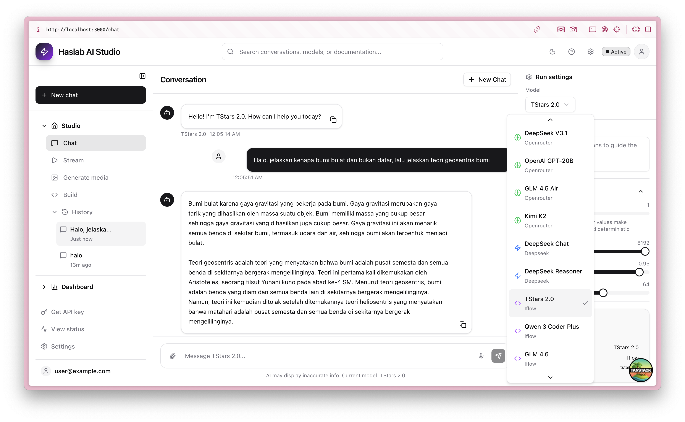

# 🚀 Haslab AI Studio

A modern, full-featured AI development workspace built with React, TypeScript, and Tailwind CSS. Haslab AI Studio provides a comprehensive suite of AI-powered tools for chat interactions, code generation, media creation, project management, and usage analytics.



## ✨ Features

### 🏠 **Studio Workspace**
- **💬 Chat Interface** - Interactive conversations with AI models
- **🌊 Stream Mode** - Real-time streaming responses 
- **🎨 Generate Media** - AI-powered image and media generation
- **🔨 Build Assistant** - Code generation and development help
- **📂 Project History** - Organized conversation and project tracking

### 📊 **Dashboard & Analytics**
- **📁 Project Management** - Track development projects and collaborations
- **📈 Usage Analytics** - Monitor API usage, costs, and performance metrics
- **💰 Cost Tracking** - Detailed breakdown of AI service costs
- **🔍 Search & Filtering** - Find projects and conversations quickly

### 🎛️ **Advanced Configuration**
- **⚙️ Model Settings** - Temperature, token limits, and advanced parameters
- **🔧 Tool Integration** - Code execution, function calling, and grounding
- **🎯 Multi-Model Support** - Gemini Pro, GPT-4, Claude, and more
- **📱 Responsive Design** - Works seamlessly on desktop and mobile

## 🖼️ Screenshots

### Chat Interface
The main chat interface with AI conversation capabilities, message history, and real-time responses.


### Project Management
Comprehensive project dashboard with progress tracking, team collaboration, and project analytics.


### Usage Analytics
Detailed usage monitoring with cost breakdown, service metrics, and performance tracking.


## 🛠️ Tech Stack

- **Frontend Framework**: React 19.0 with TypeScript
- **Routing**: TanStack React Router
- **Styling**: Tailwind CSS 4.0 with custom design system
- **UI Components**: Radix UI primitives with custom styling
- **State Management**: TanStack React Query + Store
- **Icons**: Lucide React
- **Build Tool**: Vite 7.0
- **Development**: TypeScript 5.7 with strict configuration

## 🚀 Getting Started

### Prerequisites

- Node.js 18+ 
- npm or yarn package manager

### Installation

1. **Clone the repository**
```bash
git clone https://github.com/yourusername/haslab-ai-studio.git
cd haslab-ai-studio
```

2. **Install dependencies**
```bash
npm install
```

3. **Start development server**
```bash
npm run dev
```

4. **Open in browser**
Navigate to [http://localhost:3000](http://localhost:3000)

### Build for Production

```bash
npm run build
npm run serve
```

## 🎨 Design System

### Color Palette
- **Primary**: Google Blue (#4285f4) - Primary actions and accents
- **Background**: Deep charcoal (#1a1a1a) - Main application background  
- **Cards**: Elevated surfaces (#2d2e30) - Panel and card backgrounds
- **Text**: High contrast whites (#e8eaed) - Primary text content
- **Muted**: Secondary grays (#9aa0a6) - Supporting text and UI elements

### Typography
- **Font Family**: Google Sans, Roboto, system fonts
- **Scale**: Carefully crafted type scale for optimal readability
- **Weights**: 400 (normal), 500 (medium), 600 (semibold), 700 (bold)

## 📁 Project Structure

```
src/
├── components/          # Reusable UI components
│   ├── ui/             # Base UI primitives
│   ├── chat/           # Chat-specific components
│   └── layout/         # Layout components (Header, Sidebar)
├── routes/             # Page components and routing
│   ├── __root.tsx      # Root layout
│   ├── index.tsx       # Dashboard home
│   ├── chat.tsx        # Chat interface
│   ├── stream.tsx      # Stream interface
│   ├── media.tsx       # Media generation
│   ├── build.tsx       # Code generation
│   ├── project.tsx     # Project management
│   └── usage.tsx       # Usage analytics
├── lib/                # Utilities and helpers
├── styles.css          # Global styles and theme
└── main.tsx            # Application entry point
```

## 🔧 Key Components

### Chat Interface
- **Real-time messaging** with AI models
- **Message history** with persistent storage
- **File attachments** and media support
- **Voice input** capabilities
- **Response actions** (copy, regenerate, rate)

### Code Generation (Build)
- **Multi-language support** (JavaScript, Python, Java, C#, Go, Rust, PHP)
- **Syntax highlighting** for generated code
- **Code execution** and testing capabilities
- **Project context** awareness
- **Export and download** functionality

### Media Generation
- **Text-to-image** generation with multiple styles
- **Style controls** (Realistic, Artistic, Cartoon, Abstract, Photography)
- **Size options** (Square, Landscape, Portrait formats)
- **Image gallery** with management tools
- **Download and sharing** capabilities

### Project Management
- **Project cards** with progress tracking
- **Team collaboration** features
- **Technology stack** labeling
- **Status management** (Active, Draft, Archived)
- **Search and filtering** capabilities

### Usage Analytics
- **Service usage** monitoring and visualization
- **Cost tracking** with detailed breakdowns
- **Performance metrics** and trends
- **Export capabilities** for reporting
- **Real-time updates** and notifications

## 🎯 Features in Detail

### Accordion Navigation
The sidebar uses a hierarchical accordion structure:

- **🏠 Studio** (Main workspace)
  - Chat - Interactive AI conversations
  - Stream - Real-time streaming mode  
  - Generate media - AI image generation
  - Build - Code generation assistant
  - **📂 History** - Conversation and project history
    - Recent conversations with star favorites
    - Project timeline and activity

- **📊 Dashboard** (Analytics & Management)  
  - Project - Development project management
  - Usage - Analytics and cost monitoring

### Right Panel Configuration
- **Model selection** with provider information
- **Parameter controls** (Temperature, Max tokens, Top P, Top K)
- **Media settings** (Resolution, format options)
- **Advanced features** (Thinking mode, Structured output)
- **Tool integrations** (Code execution, Function calling, Grounding)

## 🔮 Future Enhancements

- **🔌 API Integration** - Connect with real AI service providers
- **👥 Multi-user Support** - Team workspaces and collaboration
- **🔄 Version Control** - Git integration for projects
- **🧪 Testing Suite** - Automated testing for generated code
- **📱 Mobile App** - Native mobile applications
- **🔒 Enterprise Features** - SSO, permissions, audit logs

## 🤝 Contributing

We welcome contributions! Please see our [Contributing Guidelines](CONTRIBUTING.md) for details.

1. Fork the repository
2. Create a feature branch (`git checkout -b feature/amazing-feature`)
3. Commit your changes (`git commit -m 'Add amazing feature'`)
4. Push to the branch (`git push origin feature/amazing-feature`)
5. Open a Pull Request

## 📄 License

This project is licensed under the MIT License - see the [LICENSE](LICENSE) file for details.

## 🙏 Acknowledgments

- **Google AI** - For Gemini model capabilities
- **Radix UI** - For accessible component primitives  
- **Tailwind CSS** - For utility-first styling
- **TanStack** - For excellent React tooling
- **Lucide** - For beautiful, consistent icons

## 📞 Support

- **Documentation**: [Docs](https://your-docs-url.com)
- **Issues**: [GitHub Issues](https://github.com/yourusername/haslab-ai-studio/issues)
- **Discussions**: [GitHub Discussions](https://github.com/yourusername/haslab-ai-studio/discussions)
- **Email**: support@haslab.dev

---

**Built with ❤️ by the Haslab team**

*Making AI development accessible, powerful, and enjoyable for everyone.*